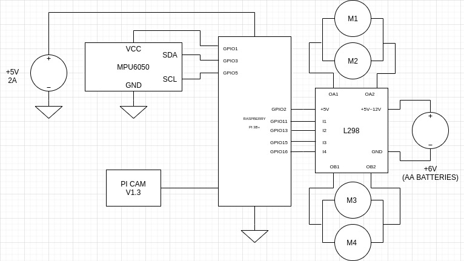

# Mobile Recon Station
A simple car you can control thru a local web server to map a plane surface or detect and follow colors in autonomous mode. See the simulation [here](https://aguilarlagunasarturo.github.io/mobile-recon-station/).

## Features
### Wireless control

### Color calibration

### Color detection

### Mapping

# Hardware
- *1* Raspberry PI 3B+
- *1* Raspberry PI Camera module
- *4* 5V Motoreductors
- *4* Wheels
- *1* Chasis
- *1* L298N
- *1* MPU6050
- *1* Powerbank 2A +5V
- *4* AA Batteries

## Electronic circuit

## Software dependencies
| Name | Installation |
| :------------- | :------------- |
| Phyton3 | [Official website](2) |
| OpenCV >= 4.5.2 | [Official guide](1) |
| numpy | `pip install numpy` |
| cv_recon | `pip install cv-recon` |
| flask | `pip install Flask` |
| smbus | `sudo apt install python3-smbus` |
| matplotlib >= 3.3.4 | `pip install matplotlib` |

## Usage
1. Install dependencies
2. Enable Raspberry PI Camera
3. Clone repo into `$HOME/Github/`
4. Run `car/systemd_service/ln_to_system.sh` to add startup rutine
5. Run  `car/systemd_service/enable.sh` to enable startup rutine
6. Reboot
7. Access Raspberry PI local IP from a web browser to control it

[1]:https://docs.opencv.org/4.5.2/da/df6/tutorial_py_table_of_contents_setup.html
[2]:https://www.python.org/downloads/
